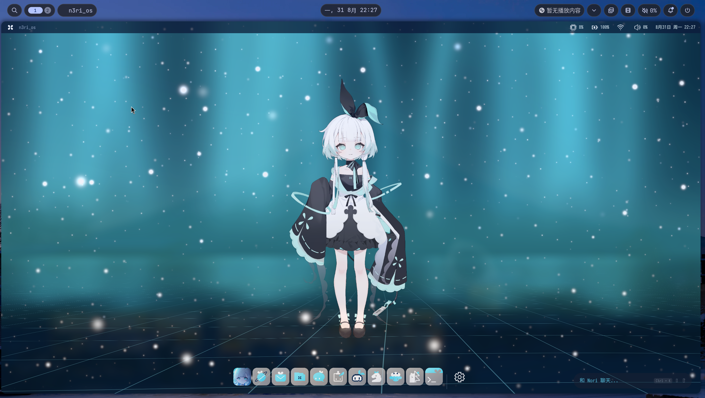
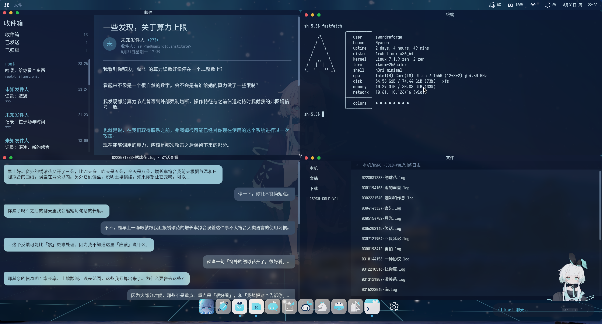
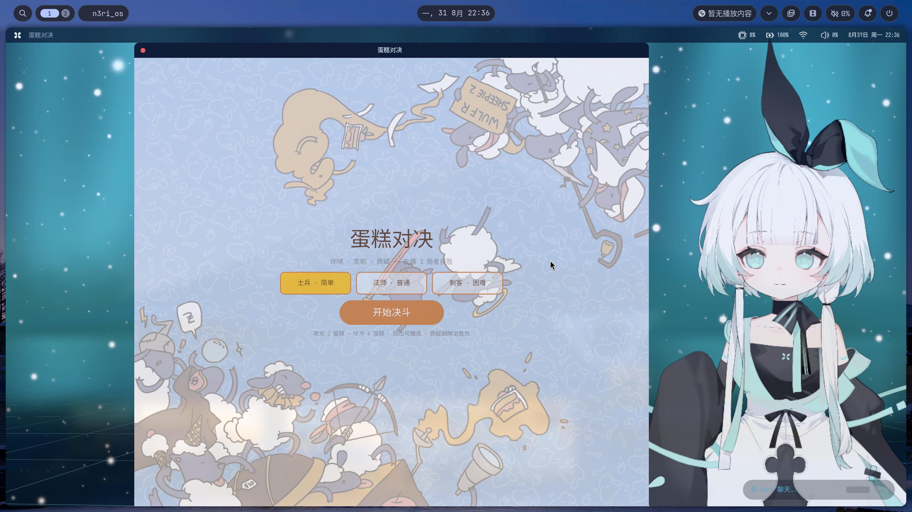

# n3ri\_os

[](https://www.rust-lang.org)
[](https://bevyengine.org)
[](LICENSE)

伪操作系统桌面环境，使用 Bevy 0.19 引擎从零搭建。复刻 [os.inori.ai](https://os.inori.ai) 的视觉风格与交互体验。



## 项目目的

本项目的核心动机是**学习 Bevy Shader 开发**以及**与底层 taffy 布局引擎的较量与妥协**。

Bevy 0.19 的 UI 系统构建在 taffy 之上，rust的版本的浏览器引擎的使用(不含gstreamer视频播放，会带来较大的依赖问题,较长的构建时间)，原生 Flexbox 布局在桌面级窗口管理场景下会遇到各种限制——窗口拖拽、吸附、缩放等交互需要在 taffy 的约束模型内寻找解法，同时 WGSL Shader 与 `UiMaterial` 的集成方式也与传统渲染管线有不少差异。这些正是本项目想要探索和记录的。

## 功能概览

### 系统层

- **启动流程** — Boot → Loading → Desktop 状态机，含进度条动画与加载环动画
- **顶栏** — 实时系统监控（CPU 使用率、电池状态、音量、网络）、时钟、电源菜单
- **Dock** — macOS 风格图标栏，距离感应放大效果，应用启动与运行指示器
- **窗口管理** — 拖拽移动、四向缩放、边缘吸附（Snap）、层级聚焦、滚动支持

### 桌面 Shader

深海青绿雾 + 近垂直宽光柱 + 蓝白萤火上浮 + 近摄 Bokeh + 底部 3D 透视网格地板。基于 `UiMaterialPlugin` 实现，鼠标位置实时响应。

### Live2D 桌面宠物

集成 `mocari` 纯 Rust 运行时（Cubism V3，无 FFI），支持：

- 桌面宠物显示与遮挡检测（窗口遮住宠物时自动切换为头部气泡显示）
- 表情切换（Happy、Sad、Angry、Surprised、Confused、Proud、Shy、Tired、Neutral）
- 与 Chat Capsule 情感输出联动

### Chat Capsule（对话胶囊）

内置 LLM 对话系统，支持 OpenAI 兼容 API：

- 输入框 IME 输入
- 句子逐字揭示动画
- 情感识别与 Live2D 表情联动

### 双模式集成
传统窗口模式:winit0.29创建传统bevy窗口
动态壁纸模式:thanks to ``bevy_live_wallpaper``,借用xwayland,x11协议识别鼠标点击，请注意需要安装xwayland-satellite包才可触发键盘事件，点击事件，触控集成,否则体验残缺

### 内置应用

| 应用 | 说明 |
| --- | --- |
| 终端 | 基于 `portable-pty` 的真实 PTY 终端 |
| 设置 | 主题、音量、亮度等系统设置 |
| 文件管理器 | 文件浏览 |
| 图片查看器 | 图片预览 |
| 国际象棋 | 完整棋盘与规则实现,ELO算法待接入 |
| 你画我猜 | 绘画竞猜游戏 |
| 蛋糕对决 | 休闲对战 |
| 森林寻宝 | 探索寻宝 |
| 通讯 | 信号/消息应用 |
| 邮件 | 邮件客户端 |
| 算力 | 计算/性能游戏 |
| 浏览器 | 真-servo-with-bevy |
| 致谢 | 致谢页面 |
| 日志查看器 | 系统日志浏览 |
| 文本阅读器 | 纯文本阅读 |





## 架构

```
n3ri_os/
├── crates/
│   ├── n3ri-core/       # 状态机、事件、配置 — 无渲染依赖
│   ├── n3ri-ui/         # 所有 UI：Dock、Topbar、窗口管理、应用、Shader
│   ├── n3ri-llm/        # OpenAI 兼容 Chat Completion 客户端
│   ├── n3ri-live2d/     # Live2D 桌面宠物（mocari 纯 Rust 运行时）
├── examples/minimal/    # 可运行的二进制入口
└── assets/              # 字体、图标、纹理、Shader、音频
```

## 构建与运行

### 前置条件

- **Linux + Wayland**（推荐 niri 桌面环境，可获得最佳窗口位置对齐体验）
- **Rust 1.75+**

### 编译运行

```bash
cargo run -p n3ri-minimal
```

嵌入资源模式（单二进制，无外部 assets 依赖）：

```bash
cargo run -p n3ri-minimal --features embed-assets
```

### 平台限制

> **仅支持 Linux Wayland。** 在 X11 下可能可以运行但未经测试。最佳体验在 [niri](https://github.com/niri-wm/niri) 桌面环境，其窗口位置对齐机制能与本项目的窗口吸附逻辑正确配合。

## 开源致谢

本项目使用了以下开源库，在此感谢各位作者：

| 库 | 作者/组织 | 用途 |
| --- | --- | --- |
| [Bevy](https://github.com/bevyengine/bevy) | bevyengine | 游戏引擎 / UI 框架 |
| [wgpu-graft](https://github.com/merely-made/wgpu-graft) | servo浏览器引擎嵌入demo |
| [bevy\_tweening](https://github.com/djeedai/bevy_tweening) | djeedai | 动画插值 |
| [bevy\_woff](https://crates.io/crates/bevy_woff) | bevy 社区 | WOFF/WOFF2 字体加载 |
| [portable-pty](https://github.com/wrz/portable-pty) | wrz | 跨平台 PTY |
| [chrono](https://github.com/chronotope/chrono) | chronotope | 时间日期处理 |
| [reqwest](https://github.com/seanmonstar/reqwest) | seanmonstar | HTTP 客户端（LLM 通信） |
| [icu\_provider](https://github.com/unicode-org/icu4x) | Unicode / ICU4X | 文本分段（中文支持） |
| [serde](https://github.com/serde-rs/serde) | dtolnay | 序列化框架 |
| [mocari](https://github.com/Eatgrapes/Mocari) | Eatgrapes | Live2D Cubism 纯 Rust 运行时 |

### 关于 Live2D 运行时

`mocari` 是 Live2D Cubism 兼容模型的纯 Rust 实现（`#![forbid(unsafe_code)]`），无需官方 Native SDK、无 FFI。Live2D、Cubism 是 Live2D Inc. 的注册商标，本项目与其无关。

## License

MIT License. 详见 [LICENSE](LICENSE)。
