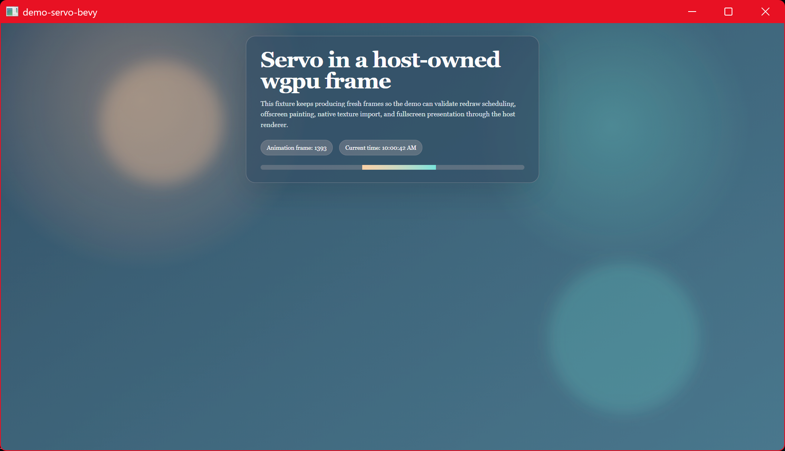

# demo-servo-bevy

Servo embedded in a [Bevy] app, zero-copy. Bevy's render world runs on its own
thread and Servo's surfman/GL context is `!Send`, so this uses the same
**shared-handle seam** as the iced demo: the producer exports a D3D12 shared NT
handle and Bevy's render world opens it on its own `RenderDevice`. No CPU
readback.



## How it works

1. **Main world:** Servo is a `NonSend` resource. A system paints it and calls
   `current_dx12_shared_texture()` to export a D3D12 shared handle into a `Send`
   `ServoFrame` resource (handle carried as a `u64`).
2. **Extract:** an `ExtractSchedule` system copies `ServoFrame` (and the
   placeholder image's `AssetId`) into the render world.
3. **Inject:** a render-world system (after `RenderSystems::PrepareAssets`,
   before `Queue`) opens the handle on Bevy's `RenderDevice` via
   `grafting::import_dx12_shared_texture`, builds a `GpuImage`, and inserts it
   into `RenderAssets<GpuImage>` for the placeholder image's id.
4. A `Sprite` on that `Handle<Image>` — sized each frame to the window minus a
   top URL bar — is rendered by Bevy's normal 2D pipeline, sampling the Servo
   texture.

A **browser chrome** (Bevy UI strip at the top) provides the standard
navigation controls — back / forward / reload / home buttons, an editable
**URL field**, and a **Go (转到)** button. Click the field to type a URL
(scheme-less input gets `https://` prefixed), press `Enter` or the Go button to
navigate, `Esc` to cancel. While the field is focused it owns
keyboard/mouse/IME input so keystrokes do not reach the page underneath; the
Servo viewport occupies the area below the chrome. Back/forward/reload/home act
on Servo's history via `go_back` / `go_forward` / `reload` / `load(home)`
(home is the startup URL).

The bar behaves like a browser address field: focusing selects the whole URL so
typing replaces it, `Ctrl/Cmd+C`/`X`/`V`/`A` provide copy/cut/paste/select-all
against the OS clipboard, and the OS IME (e.g. pinyin) composes inline — the
candidate window anchors just below the bar's text and committed text lands in
the field, so Chinese URLs can be typed directly.

surfman/ANGLE is LUID-anchored to a throwaway HighPerformance-DX12 device, and
Bevy is forced to DX12 + HighPerformance (`WgpuSettings`), so the shared handle
stays single-GPU.

## Requirements (Windows)

- **DX12.** Set via Bevy's `WgpuSettings { backends: DX12, power_preference:
  HighPerformance }`. Required by the ANGLE-D3D11 → DX12 import path.
- **ANGLE DLLs.** `libEGL.dll` / `libGLESv2.dll` produced by `mozangle`'s
  `build_dlls` feature (via `demo-support`) and copied next to the binary by
  `build.rs`.

## wgpu version

Bevy 0.18 stable is on wgpu 27; **0.19 is on wgpu 29**, matching the
grafting default, so the imported texture is Bevy's own `wgpu::Texture` type with
no new grafting version.

## Run

```sh
cargo run -p demo-servo-bevy                         # built-in animated fixture
cargo run -p demo-servo-bevy -- https://example.com  # load a URL
DEMO_USER_AGENT="Mozilla/5.0 ..." cargo run -p demo-servo-bevy  # custom UA
```

The demo spoofs a desktop Chrome UA (`Chrome/126.0.0.0` Windows NT 10.0) instead
of Servo's self-identifying `Servo/… Firefox/…` string; override with the
`DEMO_USER_AGENT` environment variable.

Mouse, keyboard, and IME input are forwarded to the page when it owns focus:
mouse events drive hover/click/scroll, keyboard events (letters, digits, space,
backspace, ...) are mapped through `keyutils.rs`, and IME composition
(Preedit/Commit) reaches the focused editable element. When an editable field
gains focus Servo reports its rectangle, which this demo mirrors onto the Bevy
window (`ime_enabled` + `ime_position`, offset below the URL bar), so the OS IME
anchors its candidate window at the field. While the URL bar is focused, all of
this input is routed to the bar instead.

[Bevy]: https://bevyengine.org

## License

[MPL-2.0](../LICENSE)
